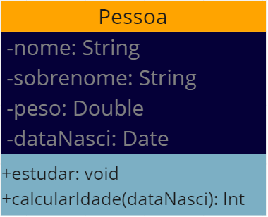

UML - Unified Modeling Languagem ou Linguagem de Modelagem de propósito geral, para desenvolvimento em engenharia de software, que permite visualizar de uma forma padronizada o projeto (design de um sistema). Trata-se então de uma linguagem unificada que habilita profissionais de TI a modelar e documentar aplicações de software. Em termos de design, a UML oferece um meio de visualizar a arquitetura de um sistema por meio de **diagramas**, incluindo atividades, componentes individuais do sistema, a interação desses componentes, interfaces, interação com o mundo externo, entre outras. É importante dizer que UML não é um método de desenvolvimento em si, é independente de plataforma / linguagem.

## Diagrama

Diagrama: Representação gráfica (geralmente parcial) do modelo de um sistema.

Os diagramas representam duas visões distintas de um modelo de sistema:
- **Estática** (estrutural) - estrutura estática por meio de objetos, operações, relações e atributos.

- **Dinâmica** (comportamental) - comportamento dinâmico por meio da colaboração entre os objetos e mudanças de seus estados internos.

### Diagramas Estruturais

- Classes
- Objetos
- Pacotes
- Componentes
- Implantação
- Estrutura Composta
- Perfil

### Diagramas comportamentais

- Caso de Uso
- Sequência
- Comunicação
- Máquina de Estados
- Atividade
- Visão Geral de Interação
- Temporização

### Diagrama de Classe

Um diagrama de classes é usado para descrever a estrutura estática de classes no sistema, permitindo definir os **atributos**, **métodos** e **relacionamentos** entre as classes. Apresenta uma visão estática da organização das classes, definindo sua estrutura lógica. É um dos diagramas mais populares, e serve como base para a construção de outros diagramas UML. 
Basicamente, descreve o que deve estar presente no sistema modelado.

#### Classes, Atributos e Métodos

Uma **classe** é uma representação de um item do mundo real, físico ou abstrato, na forma de um tipo de dados personalizado. As classes possuem estruturas internas chamadas de *Atributos* e *Métodos*.

- **Atributos** são usados para armazenar os dados dos objetos de uma classe.
- **Métodos** são as operações, ou funções que a instância da classe pode executar. 
- Uma instância de classe é chamada de **Objeto**.

##### Exemplo de Classe:

Classe: Pessoa
Atributos: Altura, Nome, Idade, Peso
Métodos: Andar, Comer, Falar, Estudar, Dormir, Trabalhar

#### Representação de uma Classe no Diagrama

Representamos uma classe usando um diagrama dividido em três compartimentos:
- `Nome`: Inclui o nome o estereótipo da classe (informação sobre a classe)
- `Atributos`: Lista de atributos da classe no formato **nome**:*tipo* ou **nome**:*tipo=valor* se houver um valor padrão
- `Operações`: Lista de métodos da classe no formato **método**(*parâmetros*):*tipo_de_retorno*

##### Visibilidade dos Membros (Atributos / Métodos)

- + Público
- \# Protegido
- - Privado
- ~ Pacote
- / Derivado

##### Exemplo

O nome da classe está no campo amarelo, enquanto os atributos estão no campo de  azul-escuro e os métodos no campo azul-claro. ==Note que os atributos tem um - antes do nome, indicando que são privados, e os métodos tem um + antes do nome, indicando que são públicos.==

#### Relacionamentos entre Classes

Um Relacionamento é uma **conexão** entre itens. Existem vários tipos de relacionamentos possíveis entre classes:

- Dependência
- Associação
- Agregação
- Composição
- Generalização

Cada um desses relacionamentos possui uma representação gráfica específica.