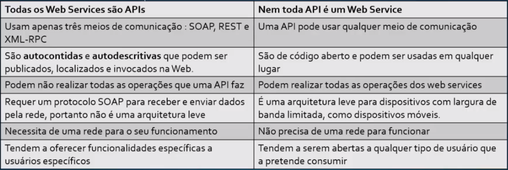
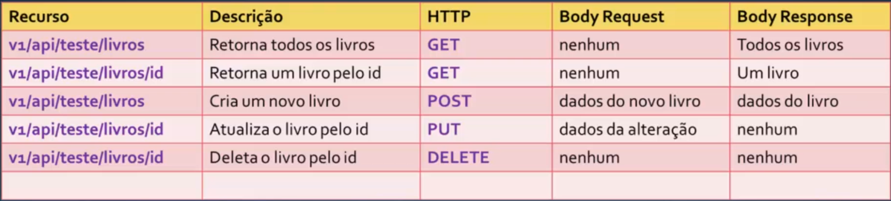
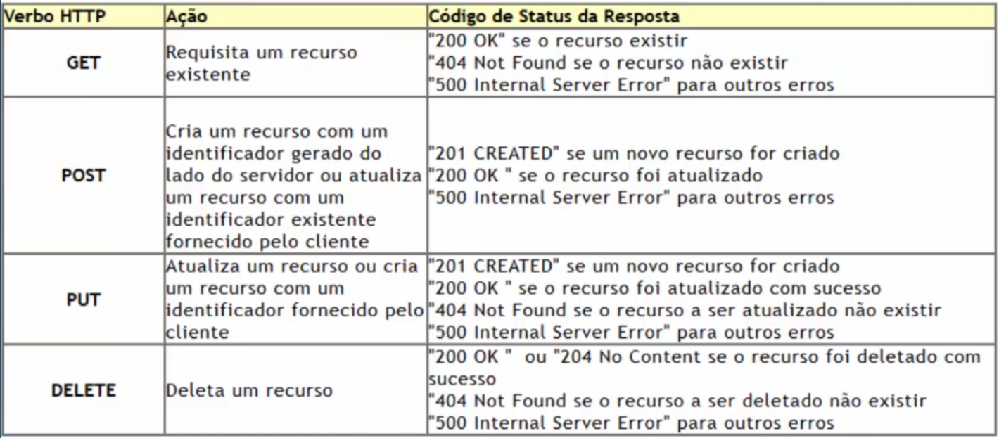
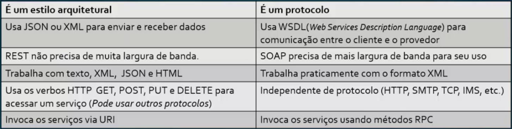

## API

API - Application Programming Interface. Se trata de um conjunto de rotinas e padrões estabelecidos e documentados por uma aplicação para que outras aplicações consigam utilizar suas funcionalidades sem precisar conhecer detalhes de sua implementação.

- Permitem fazer a integração de sistemas
- Facilitam o intercâmbio de informações
- Oferecem maior segurança nos dados
- Permite fazer o controle de acesso
- São fáceis de implementar e usar

Existem APIS públicas (que podem ser pagas ou não) e privadas (que são usadas por grupos seletos ou no sistema interno de uma empresa).

## Web Services

Web Services são um conjunto de métodos invocados por outras aplicações utilizando tecnologias Web, sendo uma solução utilizada na integração de sistemas e na comunicação entre aplicações distintas.

- Estão apoiados no XML e no protocolo SOAP
- Permitem integração de sistemas
- Permitem a reutilização de código
- Podem ser desenvolvidas em tempo reduzido
- Apresentam maior segurança

Os Web Services são APIS que se comunicam por meio de *redes*, principalmente utilizando o protocolo SOAP.

## Diferenças entre Web Service e APIS
###                          Web Service                                            API


## Web API

A Web API é uma evolução do Web Service. Se trata de uma **API na internet**, com um conjunto de serviços expostos via web para realizar a integração da aplicação com diversos tipos de clientes (web, mobile, desktop, etc).

- Podem ser criadas utilizando as mais diversas tecnologias: Java, .NET, Ruby on Rayls, JavaScript, Node.js
- Podem ser acessadas usando o protocolo [HTTP](conceitos/http.md)
- As respostas são em um formato específico, como [XML](conceitos/xml.md) ou [JSON](conceitos/json.md) (mais utilizado)
- Tipo de repostas: arquivo de texto, imagem , som, operação, banco de dados, objetos, e vários outros
- Podem ser criadas utilizando o protocolo **SOAP** ou **REST** (mais utilizado)


### SOAP

SOAP - Simple Object Acess Protocol. É um protocolo (W3C) baseado em XML, usado para trocar informações entre aplicações no mesmo ou em diferentes sistemas operacionais.

- Todas as mensagens SOAP usam o mesmo formato
- É independente de protocolo (HTTP, SMTP, etc) e retorna XML
- Um navegador não pode armazenar em cache uma solicitação concluída a uma API SOAP

### REST

REST - Representational State Transfer Protocol. É um **estilo arquitetural** para a concepção de sistemas distribuídos. Não é um padrão, não é uma tecnologia, mas é um **conjunto de restrições**, um conjunto de regras.

As principais restrições REST são:
- Ter um relacionamento **cliente/servidor**
- Não possuir monitoração de estado (stateless)
- Ter uma **interface uniforme** (URIs, representação, mensagens auto-descritivas, hipermidia (hiperlink, hipertexto))
- Suportar o **cache** de dados e respostas
- Suportar um sistema em camadas

#### Arquitetura Cliente/Servidor REST

- `Recurso` - É uma abstração sobre um tipo de informação que uma aplicação gerencia que possui uma identificação única (URI).
- `Representação` - É um instantâneo do estado de um recurso em um ponto no tempo. Uma sequência de bytes associados com metadados.
- `Interações sem estado (Stateless)` - A comunicação entre o cliente e o servidor sempre contém todas as informações necessárias para executar a solicitação.
- `Mensagens` - As mensagens devem ser autodescritivas. No HTTP usa-se os verbos **GET, POST, PUT e DELETE** e o **header, body, location, media-type**.

#### WEB API REST

Quando uma WEB API adere aos princíos REST temos um serviço **RESTful**. A primeira coisa a fazer ao criar um serviço RESTful é determinar quais recursos vamos expor, exemplo:

- Todos os livros cadastrados
- Um livro cadastrado
- Todos os livros de um autor

Após definir os recursos que o serviço expõe, mapeamos os recursos para URIs (também conhecido como **endpoint**):

http://api/teste/livros
http://api/teste/livros/1
http://api/teste/autor/1/livros

Para consumir os recursos de um serviço RESTful, usamos o protocolo HTTP e os verbos: **GET, POST, PUT, DELETE**.



==As Body Response, na verdade, são códigos de Status HTTP da operação. Com o Status é possível saber se uma operação foi realizada com sucesso.==



Como podemos ver acima, os status são:

- 1xx - Informativo
- 2xx - Sucesso
- 3xx - Redirecionamento
- 4xx - Erro do cliente
- 5xx - Erro do servidor


### Diferenças entre REST e SOAP
####                           REST                                                      SOAP


### ASP .NET Core

É o framework da Microsoft para criar Web APIs aderentes ao estilo REST (Restful) na plataforma .NET Core.

- Permite criar serviços **RESTful**, conhecidos como Web APIs usando a linguagem C#
- Para tratar as solicitações usa os **Controladores** que são classes C#
- Podemos também usar as **Minimal APIs** para tratar os requests criando APIs com apenas um único arquivo

Uma API é RESTful quando ela adere ao estilo REST. Algumas diretrizes do estilo REST:
- Possuir uma arquitetura cliente-servidor
- Ser sem estado
- Ter uma interface uniforme

## Níveis de maturidade de Richardson

### REST

REST (Representational State Transfer) é um estilo de arquitetura popular para projetar serviços da web para buscar ou alterar dados remotos. As APIs que estão em conformidade com as **regras ou restrições REST** são consideradas mais maduras porque oferecem facilidade, flexibilidade e interoperabilidade.

- Puristas: Seguem à risca as regras/retrições REST
- Pragmáticos: Ignoram algumas regras e implementam outras

Para classificar essas APIs podemos usar o Modelo de maturidade de Richardson. É um modelo sugerido em 2008 por Leonard Richardson, que classifca as APIs com base em sua aderência e conformidade com cada um dos **quatro níveis** do modelo (quanto maior nível melhor):

- Nível 0: POX - Plain Old XML
- Nível 1: Recursos
- Nível 2: Verbos HTTP
- Nível 3: HATEOAS (Ou HYPERMEDIA)

A maturaidade de um serviço é baseada em três fatores neste modelo:
1. Recursos/URI
2. Verbos HTTP
3. HATEOAS (Hipermídia)

## Criando uma API

Existem dois tipos:
### Controllers ou Controladores

Os Controllers são arquivos armazenados dentro da pasta Controllers, criada na raiz de uma aplicação *Asp .Net Core Web API* usando o template de proejto padrão. Os controladores são o cérebro de uma aplicação Asp . Net Core. Em uma Web API, eles são classes que derivam da classe **ControllerBase**.

A classe **ControllerBase** fornece muitas propriedades e métodos que são úteis para lidar com requisições HTTP.

- BadRequest() - Retorna o status code 400
- NotFound() - Retorna o status code 404
- CreatedAtAction() - Retorna o status code 201
- PhysicalFile() - Retorna um arquivo
- TryValidationModel() - Invoca a validação do modelo
- Ok() - Retorna o status code 200


O nome de um Controller é formado pelo o nome do controlador seguido do sufixo Controller. Ex: CategoriasControler, ProdutosController

#### Atributos do Controller

O atributo **ApiControler** permite decorar os controladores habilitando recursos como:
- Requisito de roteamento de atributo
- Resposta 400 automáticas (Validação do Model State)
- Inferência de parâmetro de origem de associação
- Inferência de solicitação de dados de várias partes/formulários
- Uso de **Problem Details** para códigos de erro

O atributo **Route** especifica um padrão de URL para acessar um **controller ou action**:
`[Route("[controller]")` -> indica a rota com o nome do controlador

## Registro do serviço

Para que os controladores possam ser utilizados, precisamos configurar algumas coisas na classe Program:

```cs
var builder = WebApplication.CreateBuilder(args);

builder.Services.AddControllers();

var app = builder.Build();

// Configura os pedidos HTTP
app.UseHttpsRedirection();
app.UseAuthorization();

// Mapeamento dos controllers
app.MapControllers();

// Faz o programa rodar
app.Run();
```


### Minimal APIs

As Minimal APIs usam os novos recursos do C# como Global using e unstruções de nível superior, de forma a otimizar a experiência de inicialização do aplicativo. Usando onvo template para criar uma Web Api temos que:

- Não existe mais o arquivo Startup.cs
- É usado o novo recurso implicit usings
- É usado o novo modelo de hospedagem com WebApplication.Createbuilder
- As instruções de nível superior são usadas no arquivo Programa.cs (sem namespace, classe ou declarações de método)
- São usados os tipos de referência anuláveis

